::github{repo="therustymate/PE2Pack"}

## Disclaimer
This project and all associated materials are provided **strictly for authorized testing and educational purposes only.**

**Unauthorized engagements using this project and associated materials are strictly prohibited.** 
Unauthorized access on devices using this project and associated materials may cause serious legal consequences.

## How does a PE packer work

### 1. PE Validation
A custom x64 Windows PE packer first validates `IMAGE_DOS_HEADER`, `IMAGE_NT_HEADERS64`, and the architecture (`IMAGE_FILE_HEADER`) to confirm the given raw data is in PE format.

---

Validating the `IMAGE_DOS_HEADER`:

```c
#define IMAGE_DOS_SIGNATURE 0x5A4D

IMAGE_DOS_HEADER *dos = (IMAGE_DOS_HEADER *)data; // Type cast to a pointer of IMAGE_DOS_HEADER.
if (dos->e_magic != IMAGE_DOS_SIGNATURE) { // Verify magic bytes: 0x5A4D (MZ).
    return FALSE; // The given data does not contain a valid DOS header.
}
return TRUE; // DOS header is validated.
```

---

Validating the `IMAGE_NT_HEADERS64`:

1st: Identify NT header offset from the field, `e_lfanew` in DOS header:
```c
// Base Address + dos->e_lfanew (NT header offset)
IMAGE_NT_HEADERS64 *nt = (IMAGE_NT_HEADERS64 *)(data + dos->e_lfanew);
```

2nd: Validate the header using the `Signature` field:
```c
#define IMAGE_NT_SIGNATURE 0x00004550

// Verify NT header signature: 0x00004550
if (nt->Signature != IMAGE_NT_SIGNATURE) {
    // 1. The given data does not contain a valid NT header.
    // 2. The identified NT header offset is invalid.
    return FALSE;
}
return TRUE; // NT header is validated.
```

---

Validating the architecture (`IMAGE_FILE_HEADER`):

1st: Identify File header using the NT header:
```c
IMAGE_FILE_HEADER *file = (IMAGE_FILE_HEADER *)&nt->FileHeader;
```

2nd: Validate the architecture using the field, `Machine`:
```c
#define IMAGE_FILE_MACHINE_AMD64 0x8664

if (file->Machine != IMAGE_FILE_MACHINE_AMD64) {
    // 1. The file is not x64.
    // 2. The given file is not valid PE file.
    return FALSE;
}
return TRUE; // The architecture is x64.
```

### 2. Memory Allocation
After validating the headers, it will allocate and load the image into an executable memory region. This region often has RWX or RX permissions.
Allocating RWX (Read-Write-eXecutable) memory region often draws suspicion as common executable programs often do not allocate a memory region with 
RWX permission for the program's safety. However, executable packers and shellcode loaders often do this. 

On the other hand, changing the memory permission from RW to RX is similar to JIT compiler behaviours, mainly used by Java, C#, and JavaScript.
This "can" be less suspicious as common programs written in Java and C# can show similar behaviours (RW to RX transition).
The JIT compilation approach is better if I was planning to create a defense evasive packer (formally known as crypter/protector).

In this example, RWX permission is simpler and still acceptable as many non-commercial and commercial packers use embedded RWX sections.
These sections are quite different as it doesn't allocate RWX regions in memory at runtime, it has its own embedded RWX sections.

For example, Themida, a commercial PE protector creates a RWX section embedded within the PE file:
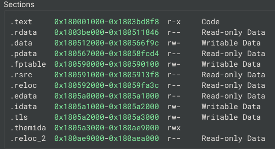

Another example, UPX creates a RWX section embedded within the PE file as well:
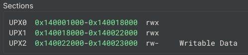

---

```c
BYTE *image = (BYTE *)VirtualAlloc(
    NULL,                               // No designated memory address.
    nt->OptionalHeader.SizeOfImage,     // Allocation size = Image size.
    MEM_COMMIT | MEM_RESERVE,           // Allocate (commit) and reserve at the same time.
    PAGE_EXECUTE_READWRITE              // RWX (Read-Write-eXecutable).
);
```

### 3. Memory Mapping
After allocating the memory, the packer needs to copy into the allocated memory:
```c
memcpy(image, data, nt->OptionalHeader.SizeOfHeaders);
```

`SizeOfImage` is the amount of memory required for the image and `SizeOfHeaders` is the size of headers.
the packer loads the headers first as the file layout is not identical to the memory layout.

The `VirtualAddress` and `PointerToRawData` store different data.
`VirtualAddress` stores the section RVA and `PointerToRawData` stores the file offset.
Therefore, mapping the file layout straight to the memory will result in an error.

RVA, or Relative Virtual Address is the offset of the address from the image base.

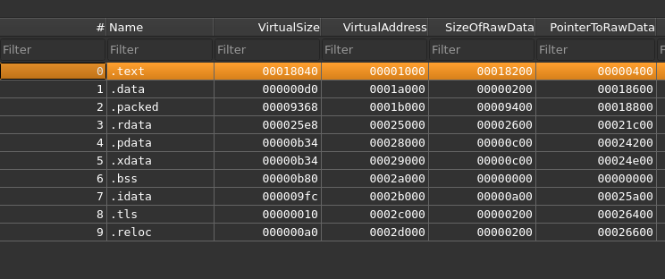

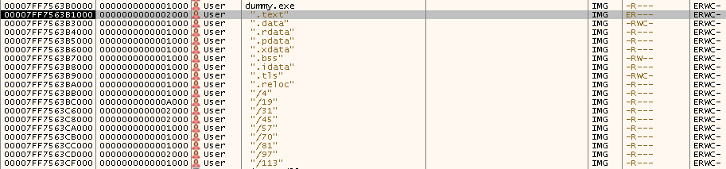

After mapping the headers, the packer then maps each section.
As it was previously mentioned, `VirtualAddress` stores the "memory offset".
In order to map each section, each `VirtualAddress` must point to the corresponding section.

Therefore, each section must be copied from its file offset (`PointerToRawData`) 
to its memory offset (`VirtualAddress`, which represents the section RVA).

```c
IMAGE_SECTION_HEADER *sections = IMAGE_FIRST_SECTION(nt);
for (WORD i = 0; i < nt->FileHeader.NumberOfSections; i++) {
    // Skip if the section is empty
    if (sections[i].SizeOfRawData == 0) continue;

    // Map the section at its RVA 
    memcpy(
        image + sections[i].VirtualAddress,     // RVA in Mapped Image
        data + sections[i].PointerToRawData,    // File Offset
        sections[i].SizeOfRawData               // Size of Section
    );
}
```

### 4. Relocation
When a program is linked, the linker records the locations of values 
that require base relocation if the image is loaded at a different base address.
To adjust these addresses, "delta" value must be calculated:

$$
Delta = Loaded Image Base - Preferred Image Base
$$

```c
// image is the pointer to the allocated memory (loaded image base)
BYTE *image = (BYTE *)VirtualAlloc(
    NULL,
    nt->OptionalHeader.SizeOfImage,
    MEM_COMMIT | MEM_RESERVE,
    PAGE_EXECUTE_READWRITE
);

// ...

// Delta = Loaded Image Base - Preferred Image Base
ULONG_PTR delta = (ULONG_PTR)image - nt->OptionalHeader.ImageBase;
```

The `.reloc` section stores base relocation entries that describe the locations of values 
that must be adjusted when the image is loaded at a different base address.

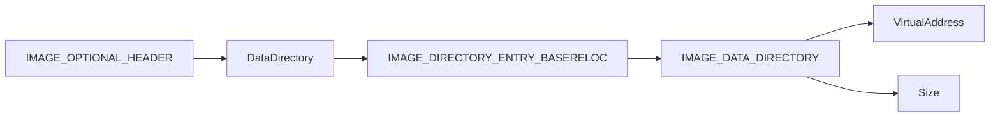

```c
IMAGE_DATA_DIRECTORY reloc_dir = nt->OptionalHeader.DataDirectory[IMAGE_DIRECTORY_ENTRY_BASERELOC];
```

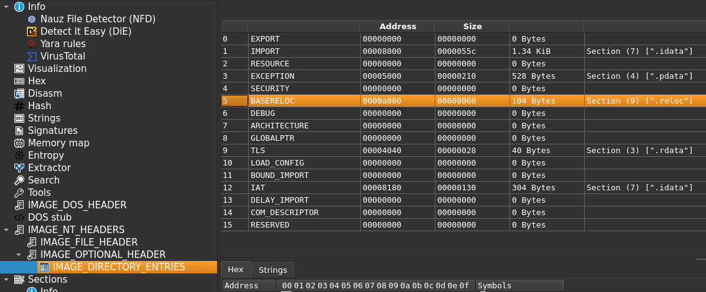

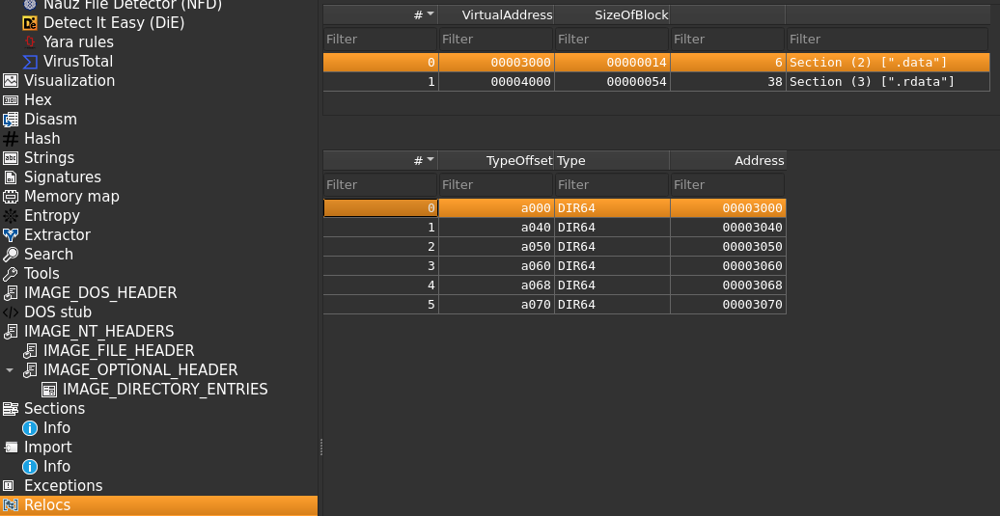

Each TypeOffset entry contains the relocation type 
in the high 4 bits and an offset within the 4 KB relocation page in the lower 12 bits.
The high 4 bits specify the relocation type. In case of x64 images, this is commonly `IMAGE_REL_BASED_DIR64`.
The low 12 bits are the offset within the 4 KB relocation page.

$$
Relocation Target VA = Loaded Image Base + Block RVA + Offset
$$

The `VirtualAddress` can be found in the relocation table.
This VA is NOT a virtual address, it is a RVA (Relative Virtual Address) which means it is an offset.

Using this information, the packer is now able to adjust absolute addresses:

```c
// First table.
IMAGE_BASE_RELOCATION *reloc = (IMAGE_BASE_RELOCATION *)(image + reloc_dir.VirtualAddress);

// Loop through each relocation tables
while (reloc->VirtualAddress > 0) {
    DWORD count = (reloc->SizeOfBlock - sizeof(IMAGE_BASE_RELOCATION)) / sizeof(WORD);
    WORD *list = (WORD *)(reloc + 1);

    for (DWORD i = 0; i < count; i++) {
        if (list[i] != 0) {
            DWORD type = list[i] >> 12;         // TypeOffset High 4 Bits (DIR64)
            DWORD offset = list[i] & 0x0FFF;    // TypeOffset Low 12 Bits (Offset)

            if (type == IMAGE_REL_BASED_DIR64) {
                // Calculate the address of the relocation target VA.
                ULONG_PTR *patch_addr = (ULONG_PTR *)(image + reloc->VirtualAddress + offset);

                // Adjust the address with "delta" value.
                *patch_addr += delta;
            }
        }
    }

    // Next relocation table.
    reloc = (IMAGE_BASE_RELOCATION *)((BYTE *)reloc + reloc->SizeOfBlock);
}
```

### 5. IAT Resolve
The `.idata` section stores import-related data 
that describes the DLLs and functions that must be resolved at load time.
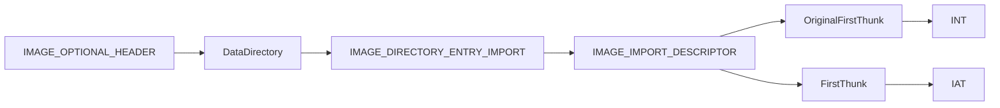

```c

IMAGE_DATA_DIRECTORY import_dir = nt->OptionalHeader.DataDirectory[IMAGE_DIRECTORY_ENTRY_IMPORT];
```

the packer will first identify and read import descriptors.

$$
Import Descriptor Location = Image Base + Virtual Address
$$

```c
// image is the pointer to the allocated memory (loaded image base)
BYTE *image = (BYTE *)VirtualAlloc(
    NULL,
    nt->OptionalHeader.SizeOfImage,
    MEM_COMMIT | MEM_RESERVE,
    PAGE_EXECUTE_READWRITE
);

// ...

// Import Descriptor Location = Image Base + Virtual Address
IMAGE_IMPORT_DESCRIPTOR *import_desc = (IMAGE_IMPORT_DESCRIPTOR *)(image + import_dir.VirtualAddress);
```

`IMAGE_IMPORT_DESCRIPTOR` is a table that describes information about imported functions of DLLs:
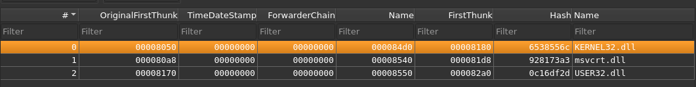

The `Name` field describes the name of DLL that needs to be imported.
The packer then loads each imported DLL using `LoadLibraryA()`:

```c
for (; import_desc->Name; import_desc++) {
    // DLL Name from IMAGE_IMPORT_DESCRIPTOR.
    char *mod_name = (char *)(image + import_desc->Name);

    // Import the DLL.
    HMODULE h_mod = LoadLibraryA(mod_name);

    // ...
}
```

Now, the packer will loop through the imported functions for each DLL and resolve them.
Before resolving the function, the packer needs to determine whether the function is imported by ordinal or by name.

```c
#define IMAGE_SNAP_BY_ORDINAL64(Ordinal) ((Ordinal & IMAGE_ORDINAL_FLAG64)!=0)

for (; original_thunk->u1.AddressOfData; thunk++, original_thunk++) {
    if (IMAGE_SNAP_BY_ORDINAL64(original_thunk->u1.Ordinal)) {
        // ...
    }

    // ...
}

```

The packer then resolves each imported function and writes its address into the corresponding IAT "thunk".

```c
typedef struct _IMAGE_THUNK_DATA64 {
    union {
        ULONGLONG ForwarderString;
        ULONGLONG Function;
        ULONGLONG Ordinal;
        ULONGLONG AddressOfData;
    } u1;
} IMAGE_THUNK_DATA64;
typedef IMAGE_THUNK_DATA64 *PIMAGE_THUNK_DATA64;
``` 

`IMAGE_THUNK_DATA64` represents an entry in the INT or IAT. 
In the INT, the entry describes how a function is imported, 
while in the IAT, the same-sized entry is eventually replaced 
with the resolved function address.

The most significant bit (bit 63) of a 64-bit thunk entry indicates 
whether the import is by ordinal. If the bit is set, the low 16 bits contain the ordinal value.

If the function is resolved using the name, the process is slightly more involved.

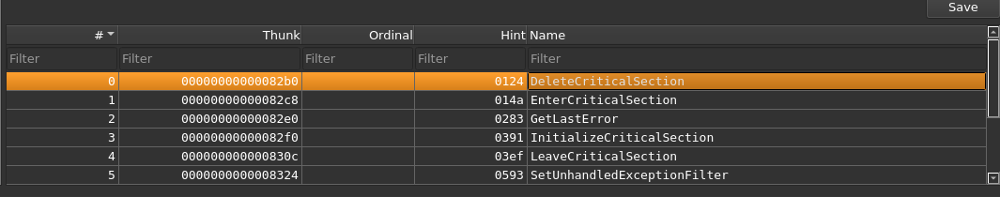

The `AddressOfData` points to the `IMAGE_IMPORT_BY_NAME` object that contains more detailed information:

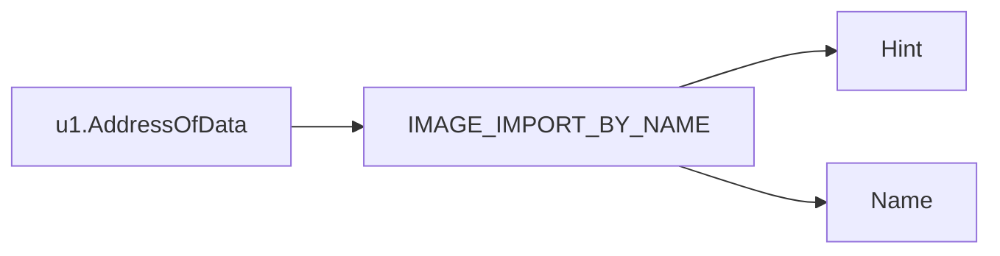

```c
typedef struct _IMAGE_IMPORT_BY_NAME {
    WORD Hint;
    char Name[1];
} IMAGE_IMPORT_BY_NAME,*PIMAGE_IMPORT_BY_NAME;
```

The `Name` field holds the name of the function in the DLL.
The `Hint` field provides an index hint into the ENT (Export Name Table).
Windows uses this `Hint` field to look up the function faster,
however, packers often do not implement this.

```c
#define IMAGE_ORDINAL64(Ordinal) (Ordinal & 0xffffull)

if (IMAGE_SNAP_BY_ORDINAL64(original_thunk->u1.Ordinal)) {
    // Low 16 bits = Ordinal.
    LPCSTR ordinal = (LPCSTR)IMAGE_ORDINAL64(original_thunk->u1.Ordinal);

    // Import the function using the ordinal number.
    thunk->u1.Function = (ULONG_PTR)GetProcAddress(h_mod, ordinal);
} else {
    // 
    IMAGE_IMPORT_BY_NAME *iibn = (IMAGE_IMPORT_BY_NAME *)(image + original_thunk->u1.AddressOfData);

    // Import the function using the name
    thunk->u1.Function = (ULONG_PTR)GetProcAddress(h_mod, (LPCSTR)iibn->Name);
}
```

### 6. Calling the Entry Point
Now, finally the packer will call the "original entry point" of the mapped program:

```c
typedef void (*ORIGINAL_ENTRY_POINT)(void);

ORIGINAL_ENTRY_POINT oep = (ORIGINAL_ENTRY_POINT)(image + nt->OptionalHeader.AddressOfEntryPoint);
oep();
```